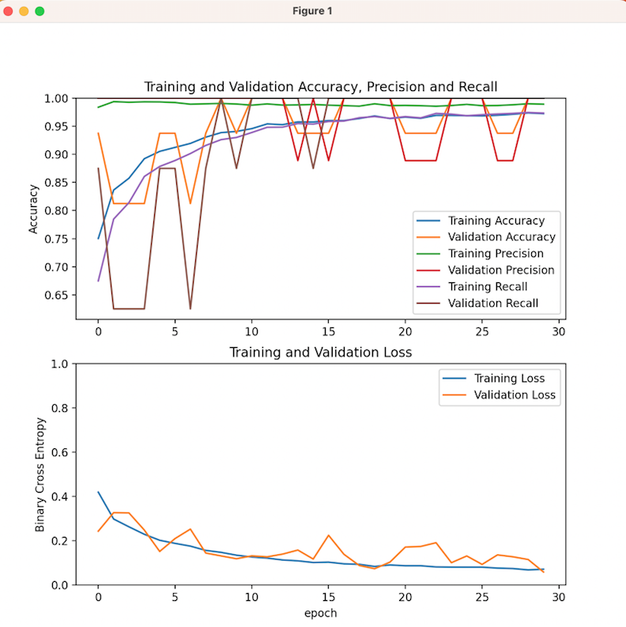

# What is this codebase about?

See [here](https://www.kaggle.com/datasets/paultimothymooney/chest-xray-pneumonia).

# How to run (on GPU)

I use [miniconda](https://docs.conda.io/en/latest/miniconda.html) through [Homebrew](https://formulae.brew.sh/cask/miniconda) on my Mac to setup the required environment. See also the details [here](https://developer.apple.com/metal/tensorflow-plugin/) about how to setup `tensorflow-metal` PluggableDevice to accelerate training with Metal on Mac GPUs. Though it didn't work out-of-the-box the way documented by the previous link on macOS 13.2.1. So this is how I managed to properly install tensorflow with GPU accelaration (status March 2023):

```
conda create -n pneumonia -c apple matplotlib tensorflow-deps python=3.10
conda activate pneumonia
python -m pip install "tensorflow-macos==2.9.0" "tensorflow-metal==0.5.0" # it wouldn't work without the explicit versions!
python pneumonia.py
```

Which yields an output similar to:

```
Found 5216 files belonging to 2 classes.
Metal device set to: Apple M1 Ultra

systemMemory: 128.00 GB
maxCacheSize: 48.00 GB

2023-04-01 17:08:29.359381: I tensorflow/core/common_runtime/pluggable_device/pluggable_device_factory.cc:305] Could not identify NUMA node of platform GPU ID 0, defaulting to 0. Your kernel may not have been built with NUMA support.
2023-04-01 17:08:29.359656: I tensorflow/core/common_runtime/pluggable_device/pluggable_device_factory.cc:271] Created TensorFlow device (/job:localhost/replica:0/task:0/device:GPU:0 with 0 MB memory) -> physical PluggableDevice (device: 0, name: METAL, pci bus id: <undefined>)
Found 16 files belonging to 2 classes.
Found 624 files belonging to 2 classes.
in the training set 2 class names to classify the images for: ['NORMAL', 'PNEUMONIA']
2023-04-01 17:08:29.457960: W tensorflow/core/platform/profile_utils/cpu_utils.cc:128] Failed to get CPU frequency: 0 Hz
image batch shape: (32, 224, 224, 3)
image label shape: (32,)
Epoch 1/15
2023-04-01 17:08:31.850119: I tensorflow/core/grappler/optimizers/custom_graph_optimizer_registry.cc:113] Plugin optimizer for device_type GPU is enabled.
163/163 [==============================] - ETA: 0s - loss: 0.4274 - accuracy: 0.76272023-04-01 17:08:53.850438: I tensorflow/core/grappler/optimizers/custom_graph_optimizer_registry.cc:113] Plugin optimizer for device_type GPU is enabled.
163/163 [==============================] - 24s 132ms/step - loss: 0.4274 - accuracy: 0.7627 - val_loss: 0.4219 - val_accuracy: 0.6875
Epoch 2/15
163/163 [==============================] - 20s 123ms/step - loss: 0.2897 - accuracy: 0.8403 - val_loss: 0.2051 - val_accuracy: 0.9375
Epoch 3/15
163/163 [==============================] - 20s 124ms/step - loss: 0.2448 - accuracy: 0.8754 - val_loss: 0.2601 - val_accuracy: 0.8750
Epoch 4/15
163/163 [==============================] - 21s 128ms/step - loss: 0.2220 - accuracy: 0.8940 - val_loss: 0.3076 - val_accuracy: 0.8750
Epoch 5/15
163/163 [==============================] - 21s 131ms/step - loss: 0.1933 - accuracy: 0.9105 - val_loss: 0.2368 - val_accuracy: 0.9375
Epoch 6/15
163/163 [==============================] - 21s 128ms/step - loss: 0.1788 - accuracy: 0.9195 - val_loss: 0.2754 - val_accuracy: 0.9375
Epoch 7/15
163/163 [==============================] - 20s 125ms/step - loss: 0.1607 - accuracy: 0.9224 - val_loss: 0.2327 - val_accuracy: 0.9375
Epoch 8/15
163/163 [==============================] - 20s 123ms/step - loss: 0.1457 - accuracy: 0.9396 - val_loss: 0.1997 - val_accuracy: 0.8750
Epoch 9/15
163/163 [==============================] - 20s 126ms/step - loss: 0.1462 - accuracy: 0.9377 - val_loss: 0.1628 - val_accuracy: 0.9375
Epoch 10/15
163/163 [==============================] - 20s 125ms/step - loss: 0.1333 - accuracy: 0.9427 - val_loss: 0.1757 - val_accuracy: 0.9375
Epoch 11/15
163/163 [==============================] - 21s 127ms/step - loss: 0.1261 - accuracy: 0.9467 - val_loss: 0.1781 - val_accuracy: 0.9375
Epoch 12/15
163/163 [==============================] - 20s 126ms/step - loss: 0.1154 - accuracy: 0.9542 - val_loss: 0.1731 - val_accuracy: 0.8750
Epoch 13/15
163/163 [==============================] - 20s 124ms/step - loss: 0.1122 - accuracy: 0.9523 - val_loss: 0.1891 - val_accuracy: 0.9375
Epoch 14/15
163/163 [==============================] - 20s 125ms/step - loss: 0.1106 - accuracy: 0.9565 - val_loss: 0.0998 - val_accuracy: 0.9375
Epoch 15/15
163/163 [==============================] - 20s 124ms/step - loss: 0.1056 - accuracy: 0.9580 - val_loss: 0.1214 - val_accuracy: 1.0000
20/20 [==============================] - 1s 26ms/step - loss: 0.3627 - accuracy: 0.8606
accuracy/loss on the test dataset: 0.861/0.363
```

The learning curves of the training and validation accuracy / loss looks as following:



Finally the created environment above can be removed through:

```
conda remove --name pneumonia --all
```

The achieved accuracy on the test dataset is `.861` as it can be spotted by the last line of the log output above.
